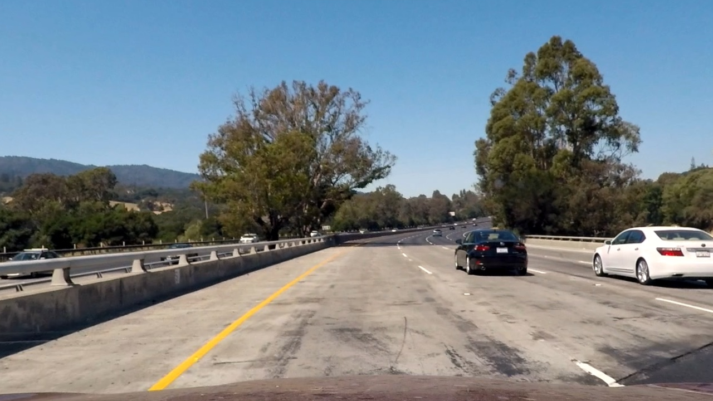
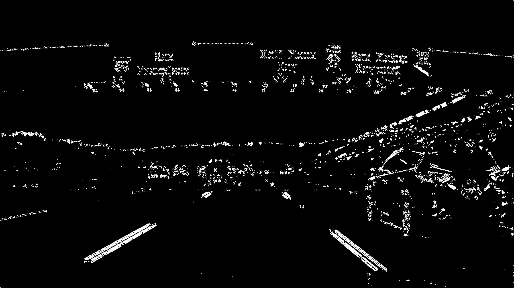
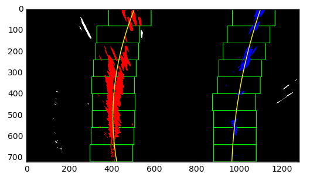

# Advanced-Lane-Finding-for-Curved-Roads
This project, from Udacity, expands on a previous repo (Lane Detection using OpenCV) by including functionality for curved roads. Uses OpenCV extensively.

## Goals/Steps of this project:

* Compute the camera calibration matrix and distortion coefficients given a set of chessboard images.
* Apply a distortion correction to raw images.
* Use color transforms, gradients, etc., to create a thresholded binary image.
* Apply a perspective transform to rectify binary image ("birds-eye view").
* Detect lane pixels and fit to find the lane boundary.
* Determine the curvature of the lane and vehicle position with respect to center.
* Warp the detected lane boundaries back onto the original image.
* Output visual display of the lane boundaries and numerical estimation of lane curvature and vehicle position.

## How does it work?

The algorithm has the following steps, in order, which ultimately results in the lane being identified and singled out in the [output video](https://github.com/vikasnataraja/Advanced-Lane-Finding-for-Curved-Roads/blob/master/out_video.mp4).
### Step 1:
### Camera Calibration

The code for this step is contained in the first code cell of the IPython notebook located in the thrid code cell of `P2.ipynb`  

I start by preparing "object points", which will be the (x, y, z) coordinates of the chessboard corners in the world. Here I am assuming the chessboard is fixed on the (x, y) plane at z=0, as the chessboard is fixed on a flat (x, y) plane so that each calibration image I use will have the same object points. Next, I am going to grab my "image points", which are where the chessboard corners are in the image. I can do this with cv2.findChessboardCorners(), a useful function for finding just where those inner corners lie in the image. Note that I have appended the object points and image points to lists to use in the next function.

Now that I have my object points and image points, I can calibrate my camera and return the distortion coefficients. I then used cv2.undistort() to see an undistorted chessboard, as shown below. such that the object points are the same for each calibration image.  Thus, `objp` is just a replicated array of coordinates (meshgrid), and `objpoints` will be appended with a copy of it every time I successfully detect all chessboard corners in a test image.  `imgpoints` will be appended with the (x, y) pixel position of each of the corners in the image plane with each successful chessboard detection.  

### Step 2:
### Pipeline

* In this step, I undistort the distorted image using `cv2.undistort()`. This is a continuation of camera calibration i.e, instead of applying to a chessboard, I apply it to the images from the car. But the ultimate aim of `pipeline` is to produce a binary image using Sobel and other thresholds as explained below.

* I used a combination of color and gradient thresholds to generate a binary image (thresholding steps at lines #28 through #40 in `pipeline`). This includes the Sobel filter derivative.
* The code for my perspective transform appears in lines 1 through 8 in the file `P2.ipynb`, in the 5th code cell of the IPython notebook.  The function takes as inputs an image (`img`), as well as matrix `mat` and `dist`.
* I verified that my perspective transform was working as expected by drawing the `src` and `dst` points onto a test image and its warped counterpart to verify that the lines appear parallel in the warped image.

Here's one I applied to a test image:

### Step 3:
#### Sliding window
* The next step was to create a sliding window to identify non-zero pixels. If above a certain threshold, I re-centered the window to their mean. I also checked if window is within the image bounds  to verify it did not go outside.

### Step 4:
#### Estimating the lane lines
* Using histograms, particularly noticing the spikes, I was able to estimate where the lane lines were.
* This increases my program speed since now I can limit my search in finding the lanes later when I accurately determine it.

### Step 5:
#### Polynomial fitting
* Since the lane lines are curved, a second-order polynomial came in handy.
* I used a basic function, a*\x^2 + b*\x + c
* The idea behind this is that second order polynomials describe curves. Like circles -> x^2 + y^2 = const
  * Similarly,a*\x^2 + b*\x + c describes a type of parabola. This works in my favor because lane curvatures tend to have variable curvatures and not a fixed one like a circle.

### Step 6:
#### Draw the lane lines
* Here, I first checked if the lanes were already detected by the previous histogram step. If yes, I just drew the lane lines using the polynomial function. 
* I also calculated the relative position of the car and the curvature of the road.

### Step 7:
#### Run the program

* After I finished all the pipeline steps and setup, I ran the program. Here is a result of what the image looks like:

[Lane detection on a curved road](output_images/lane_detect.PNG)

---

### Pipeline (video)

Here's a [link to my video result](output_video.mp4)

### Discussion

#### Shortcomings

* The most likely scenario where the algorithm might fail is when there is an obstacle directly on the road in front of the camera. This would not allow a lot of area of road and that would prove hard.

* Another scenario is when there is another curved line on the road (like a long curved piece of wood or another solid object of similar curvature to the road). The algorithm would have a hard time distinguishing between the two.

* An obvious scenario where this could fail is when there are no clear lane markings. The algorithm depends on clearly marked lines on the road and without it, it would most likely struggle to identify the region of interest.

### Improvements and future work

* An improvement that could benefit the pipeline in general would be the use of deep learning where the network learns to predict the new image instead of waiting for the each image to come through

* This algorithm solely depends on lane markings. It could be coupled with a car or any solid object (like the hood of the car) in front of it to help retain its region of interest in case the lane markings are faint. It could be implemented as a redundancy at the very least.

## How to run this:

* Clone this repo to your local directory, making sure the folders and files are in the same location as the repo.
* Open P2.ipynb (Jupyter notebook) or download it as a python file and run using a python interpreter.

